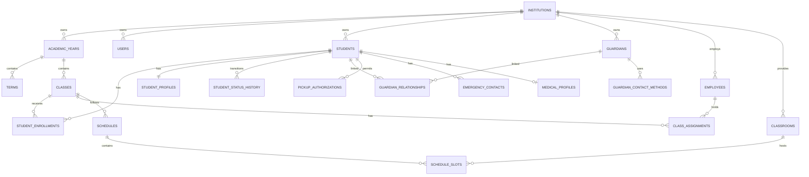
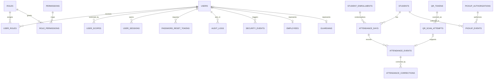
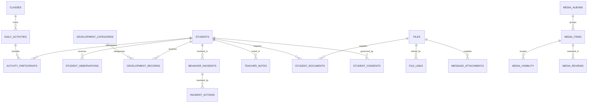
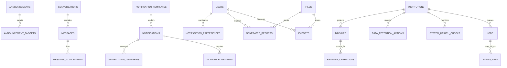

# Logical ERD Design

## Purpose and notation

This is the approved logical relationship design for Phase 2.2. It is not SQL and does not prescribe physical column types. Every entity has an internal conceptual identifier (`id`), an immutable opaque public identifier where externally exposed (`public_id`), and the ownership/audit metadata required by the Constitution. `||` means exactly one, `o{` means zero or many, and `|{` means one or many.

## Ownership boundaries

`institutions` is the root business ownership boundary. All child, guardian, staff, attendance, care, file, media, notification, report, and operational records are institution-scoped. System-controlled catalogs are still used only within this institution boundary. `students` are institution-owned: neither guardians nor teachers own student data.

## Complete entity register and conceptual identifiers

| Domain | Entities and primary conceptual identifiers |
|---|---|
| Identity | `users(user public_id)`, `roles(role code)`, `permissions(permission code)`, `user_roles(assignment id)`, `role_permissions(mapping id)`, `user_scopes(scope id)`, `password_reset_tokens(token id)`, `user_sessions(session id)`, `audit_logs(audit event id)`, `security_events(security event id)`, `system_settings(setting key)`, `setting_revisions(revision id)` |
| Structure | `institutions(institution public_id)`, `academic_years(year public_id)`, `terms(term public_id)`, `classes(class public_id)`, `classrooms(classroom public_id)`, `class_assignments(assignment id)`, `schedules(schedule id)`, `schedule_slots(slot id)`, `holidays(holiday id)` |
| Student/guardian/staff | `students(student public_id)`, `student_profiles(profile id)`, `student_enrollments(enrollment public_id)`, `student_status_history(status event id)`, `guardians(guardian public_id)`, `guardian_relationships(relationship id)`, `guardian_contact_methods(contact method id)`, `pickup_authorizations(pickup authorization id)`, `emergency_contacts(contact id)`, `employees(employee public_id)`, `medical_profiles(medical profile id)`, `student_documents(document record id)`, `student_consents(consent record id)` |
| Attendance/care | `attendance_days(attendance day id)`, `attendance_events(attendance event id)`, `attendance_corrections(correction id)`, `attendance_statuses(status code)`, `qr_tokens(token id)`, `qr_scan_attempts(scan attempt id)`, `pickup_events(pickup event id)`, `attendance_rules(rule id)`, `daily_activities(activity id)`, `activity_participants(participation id)`, `student_observations(observation id)`, `development_categories(category code)`, `development_records(record id)`, `behavior_incidents(incident id)`, `incident_actions(action id)`, `teacher_notes(note id)` |
| Communication/media | `announcements(announcement id)`, `announcement_targets(target id)`, `conversations(conversation id)`, `messages(message id)`, `message_attachments(attachment id)`, `notification_templates(template/version id)`, `notifications(notification id)`, `notification_deliveries(delivery id)`, `notification_preferences(preference id)`, `acknowledgements(acknowledgement id)`, `files(file public_id)`, `file_links(link id)`, `media_items(media id)`, `media_albums(album id)`, `media_visibility(visibility id)`, `media_reviews(review id)` |
| Operations | `generated_reports(report request id)`, `exports(export id)`, `jobs(job id)`, `failed_jobs(failure id)`, `scheduled_task_runs(run id)`, `backups(backup id)`, `restore_operations(restore id)`, `system_health_checks(check id)`, `data_retention_actions(retention action id)` |

## Relationship policies

- All user-facing and sensitive relationships use opaque public identifiers externally; internal IDs are implementation details.
- Historical links use effective dates where access or assignment changes over time: enrollment, staff assignment, guardian authority, pickup authority, role scope, and consent.
- `classrooms` is the physical-room entity; `classes` is the academic-group entity. No duplicate rooms entity exists.
- File ownership remains with the institution; `file_links` grants contextual use and never makes storage public.
- Parent portal entitlement is always evaluated through an active verified guardian relationship, then the relevant consent/visibility and policy scope.
